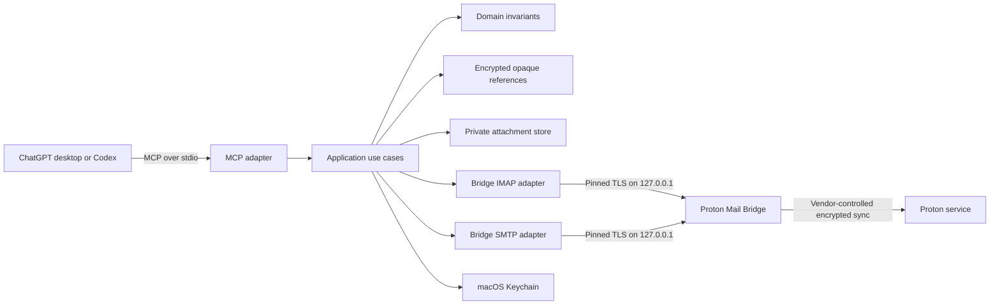
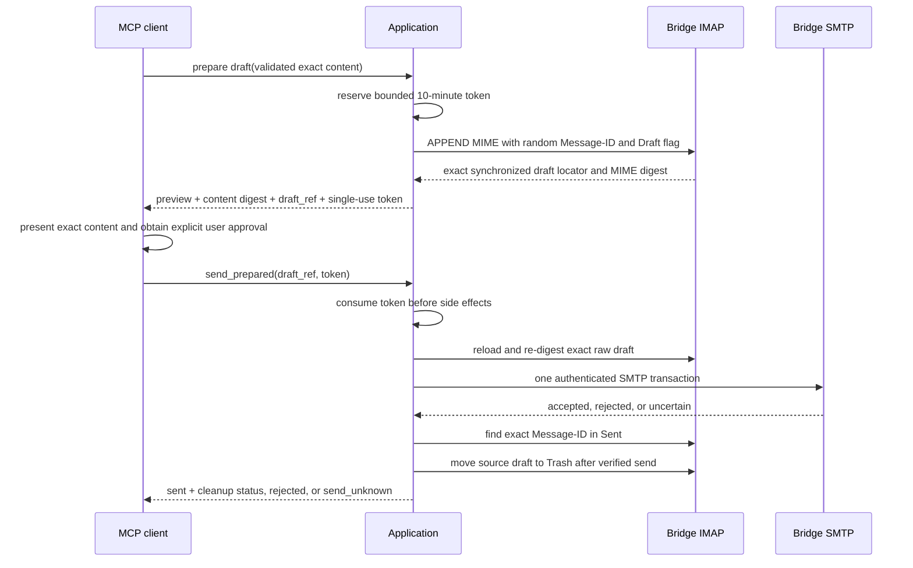

# Architecture

## System boundary

The server opens no listening socket. Its only network connections are IPv4
loopback IMAP and SMTP connections to Bridge. Bridge communicates with Proton's
service as a vendor application. The server has no AppleScript, Accessibility,
Automation, Proton Mail app, subprocess, or GUI dependency.

## Layers

- **Domain** contains validated addresses, mailbox names, subject/body types,
  message locators, draft content, and immutable submission data. It has no
  macOS, network, filesystem, subprocess, or MCP dependencies.
- **Application** coordinates metadata reads, content retrieval, mutation,
  draft lifecycle, confirmation reservation, one SMTP submission, and Sent
  verification through small ports. Authorization and single-use confirmation
  policy live here.
- **Ports** describe the IMAP repository, SMTP sender, Keychain, attachment,
  time, randomness, reference, and configuration capabilities.
- **Adapters** translate IMAP, SMTP, pinned TLS, MIME, Keychain, filesystem, and
  MCP behavior into typed application errors.
- **Composition** loads strict configuration, constructs concrete adapters,
  starts stdio MCP, and shuts down on EOF or SIGINT. `main` only initializes
  redacted stderr logging and delegates.

Dependencies point inward. The domain and application layers never import
adapter implementations.

## Read path

1. The MCP adapter validates a closed JSON schema and obtains one of eight
   bounded operation slots.
2. The application decodes the encrypted reference or a query-bound cursor.
3. The repository selects the named mailbox and revalidates UIDVALIDITY, UID,
   bounded headers, fingerprint, and Proton internal ID.
4. Metadata listing fetches only bounded headers. Full MIME is fetched only for
   `proton_get_message`, a draft revalidation, or an explicit attachment request.
5. HTML is converted locally to inert plain text. Remote resources are never
   rendered or fetched.
6. The MCP response contains only the requested bounded page and opaque child
   references.

## Mutation path

Every message mutation revalidates its exact locator. Flag updates read back
the requested flag. Moves require Bridge's atomic IMAP `MOVE` capability; there
is no copy-and-delete fallback. A move succeeds only after the source UID is
gone and the destination header is re-fetched and exactly matches the original
Proton internal ID and fingerprint.

Trash and draft discard map only to the configured Trash mailbox. Folder roles
must be pairwise distinct. No adapter exposes EXPUNGE or permanent delete.

## Draft and send state machine

The confirmation digest includes a domain separator plus length-delimited
account, To/CC/BCC lists, subject, normalized plain-text body, and every
attachment's display name, media type, size, and SHA-256 digest. A separate
stored-draft integrity digest binds the complete synchronized raw MIME plus the
exact Message-ID and thread headers. Tokens contain 256 random bits, are stored
only by SHA-256 lookup key, expire after ten minutes, and are consumed before
draft or transport validation. At most 64 can be pending.

The SMTP adapter reuses the enrolled Bridge certificate and requires both
hostname validation and the exact SHA-256 peer pin. It authenticates with the
Bridge credential from Keychain, removes BCC and draft-only headers, rejects
unsupported top-level transport headers, preserves the Message-ID, passes all
To/CC/BCC recipients in the SMTP envelope, normalizes CRLF, and dot-stuffs DATA.
Credentials and message data never enter arguments, environment variables,
logs, or temporary transfer files.

Failures before SMTP DATA are definite and consume the token without sending.
After DATA begins, a write timeout, disconnect, malformed response, or missing
final response is conservatively `send_unknown`; the server never retries it.
A final SMTP rejection is `send_rejected`. A positive SMTP reply is not final
success until IMAP finds exactly one recent Sent item with the prepared
Message-ID. If source-draft cleanup then fails, the result remains `sent` and
reports `attention_required` so callers do not retry a delivered message.

## Persisted data

- Strict versioned TOML, enrolled public Bridge certificate, and managed
  downloads live under the user's private Application Support directory.
- Version-1 configuration without SMTP fields loads additively as Bridge's
  default port 1025 with STARTTLS. Users who changed Bridge's SMTP mode to SSL
  must explicitly configure the matching implicit-TLS mode. Unknown
  incompatible versions are rejected.
- First start removes only the exact obsolete generated AppleScript file from
  the private support directory; an unexpected directory at that path fails
  closed and is never recursively removed.
- Bridge password and the 32-byte opaque-reference key live in macOS Keychain.
- Opaque references use XChaCha20-Poly1305 with a random nonce, versioned
  envelope, type tag, profile binding, and associated data.
- Logs go only to stderr and contain tool names, stable error categories,
  counts, and fixed operation labels—never email content, addresses, subjects,
  attachment paths, credentials, tokens, or protocol transcripts.

## Resource and cancellation model

Bridge connections and protocol operations have explicit timeouts. SMTP reply
lines, reply totals, capabilities, commands, message bytes, and header bytes are
bounded. IMAP scans, fetch response counts, MIME parts, body pages, attachment
sizes, managed files, recipient batches, pending confirmations, and concurrent
MCP calls are also bounded. No lock is held across network, filesystem, or
other awaited external work.

## Extension points

The current axes of change map to ports: a future repository protocol, another
mail-submission transport, another Keychain-like secret store, or a different
MCP transport can be added without moving authorization policy out of the
application layer. New destructive capabilities require an explicit product
and security-policy decision; they are not implied by these interfaces.
