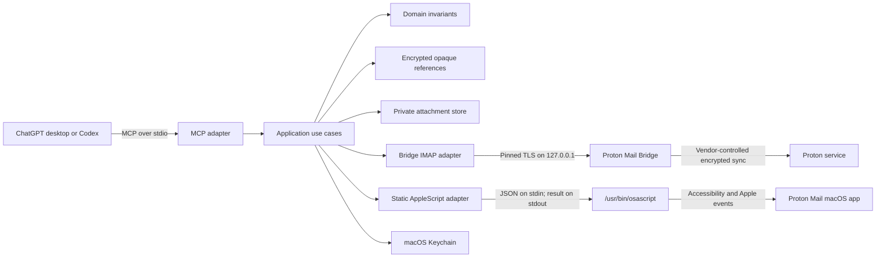
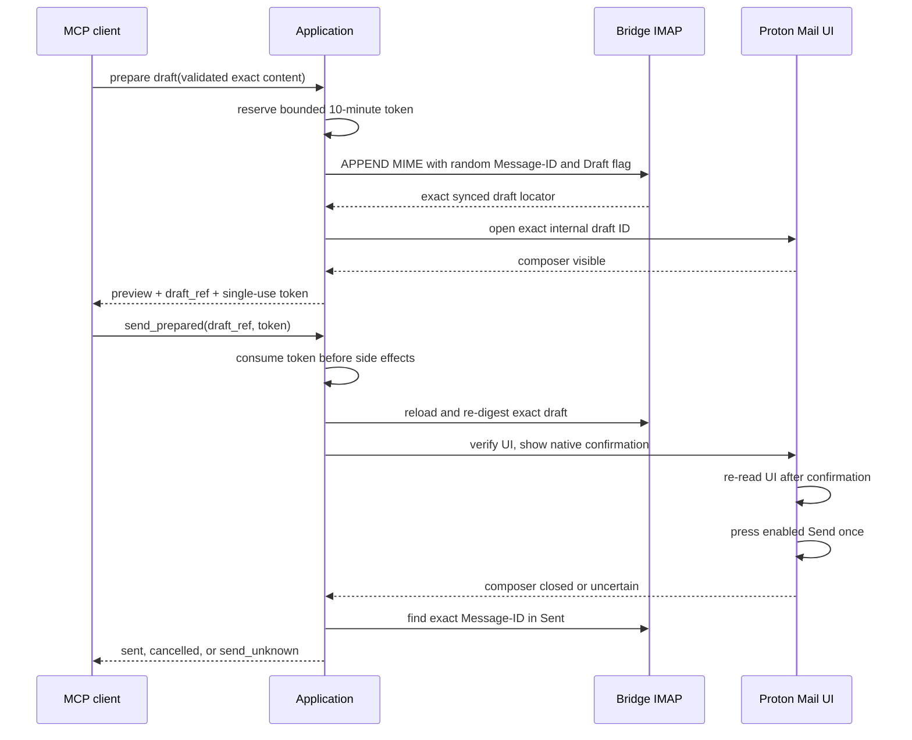

# Architecture

## System boundary

The server opens no listening socket. Its only network connection is an IPv4
loopback connection to Bridge. Bridge and the Proton Mail app independently
communicate with Proton's service as vendor applications.

## Layers

- **Domain** contains validated addresses, mailbox names, subject/body types,
  message locators, draft content, and the exact confirmation digest. It has no
  macOS, network, filesystem, subprocess, or MCP dependencies.
- **Application** coordinates metadata reads, content retrieval, mutation,
  draft lifecycle, confirmation reservation, and send verification through
  small ports. Authorization and single-use confirmation policy live here.
- **Ports** describe the repository, UI, Keychain, attachment, time, randomness,
  reference, and configuration capabilities needed by the use cases.
- **Adapters** translate IMAP/TLS, MIME, Keychain, filesystem, AppleScript, and
  MCP behavior into typed application errors.
- **Composition** loads strict configuration, constructs concrete adapters,
  starts stdio MCP, and shuts down on EOF or SIGINT. `main` only initializes
  redacted stderr logging and delegates.

Dependencies point inward. The domain and application layers never import
adapter implementations.

## Read path

1. The MCP adapter validates a closed JSON schema and obtains one of eight
   bounded operation slots.
2. The application decodes the encrypted reference or a query-bound cursor.
3. The repository selects the named mailbox and revalidates UIDVALIDITY, UID,
   bounded headers, fingerprint, and Proton internal ID.
4. Metadata listing fetches only bounded headers. Full MIME is fetched only for
   `proton_get_message` or an explicit attachment request.
5. HTML is converted locally to inert plain text. Remote resources are never
   rendered or fetched.
6. The MCP response contains only the requested bounded page and opaque child
   references.

## Mutation path

Every message mutation revalidates its exact locator. Flag updates read back
the requested flag. Moves require Bridge's atomic IMAP `MOVE` capability; there
is no copy-and-delete fallback. A move succeeds only after the source UID is
gone and the destination header is re-fetched and exactly matches the original
Proton internal ID and fingerprint.

Trash and draft discard map only to the configured Trash mailbox. Folder roles
must be pairwise distinct. No adapter exposes EXPUNGE, permanent delete, or an
SMTP send command.

## Draft and send state machine

The confirmation digest includes a domain separator plus length-delimited
account, To/CC/BCC lists, subject, normalized plain-text body, and each
attachment's display name, media type, size, and SHA-256 digest. A separate
stored-draft integrity digest also binds the exact Message-ID, In-Reply-To, and References
headers so hidden thread changes invalidate the send. Tokens contain 256 random
bits, are stored only by SHA-256 lookup key, expire after ten minutes, and are
consumed before draft/UI validation. At most 64 can be pending.

The AppleScript receives exact values as versioned JSON on standard input.
Runtime values are never interpolated into executable source, arguments,
environment variables, the clipboard, or shell commands. It resolves one
Proton process and one standard window, uses semantic Accessibility roles,
requires an exact draft URL segment, compares recipient and attachment
multisets, and checks exact From, subject, and normalized body text. It then
uses one `AXPress`. Rust independently verifies Sent; any ambiguous result is
`send_unknown` and is never retried by the server.

## Persisted data

- Strict versioned TOML, enrolled public Bridge certificate, installed static
  AppleScript, and managed downloads live under the user's private Application
  Support directory.
- Bridge password and the 32-byte opaque-reference key live in macOS Keychain.
- Opaque references use XChaCha20-Poly1305 with a random nonce, versioned
  envelope, type tag, profile binding, and associated data.
- Logs go only to stderr and contain tool names, stable error categories,
  counts, and fixed operation labels—never email content, addresses, subjects,
  attachment paths, credentials, tokens, or UI dumps.

## Resource and cancellation model

External Bridge calls have explicit timeouts. UI requests use operation-specific
process timeouts up to 140 seconds, bounded stdout/stderr, and kill-on-drop
behavior. IMAP scans,
fetch response counts, raw/header bytes, MIME parts, body pages, attachment
sizes, managed files, recipient batches, pending confirmations, and concurrent
MCP calls are bounded. No lock is held across network, UI, filesystem, or other
awaited external work.

## Extension points

The current axes of change map to ports: a future repository protocol, a new
Proton UI selector version, another Keychain-like secret store, or a different
MCP transport can be added without moving authorization policy out of the
application layer. New destructive capabilities require an explicit product
and security-policy decision; they are not implied by these interfaces.
